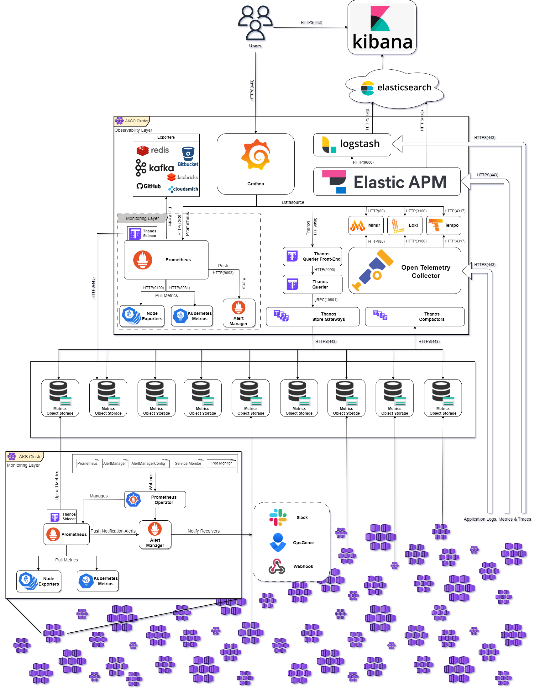
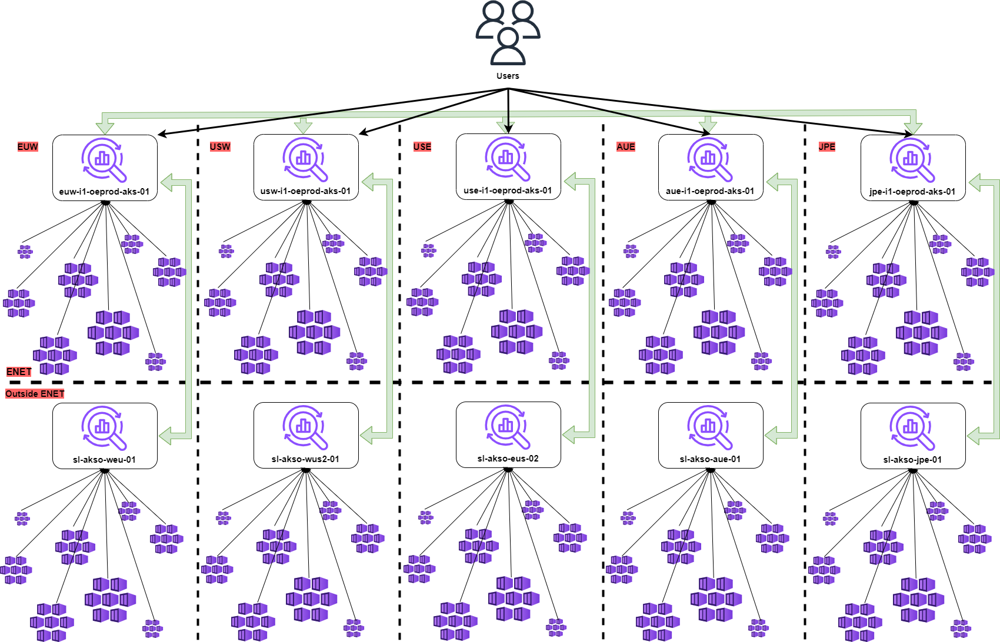

Table of contents
=================


   * [Overview](#overview)
   * [Fleet](#fleet)
   * [Architecture](#architecture)
      * [Overview](#overview-1)
      * [Interconnection](#interconnection)
   * [Repository structure](#repository-structure)
   * [Installation Steps](#installation-steps)
      * [Step 1 - Create a dedicated directory](#step-1-\--create-a-dedicated-directory)
      * [Step 2 - Make the appropriate changes to Fleet Clusters](#step-2-\--make-the-appropriate-changes-to-fleet-clusters)
      * [Step 3 - Add overlays and configure the deployment](#step-3-\--add-overlays-and-configure-the-deployment)
   * [Rules & Conventions](#rules-&-conventions)
      * [Deployment](#deployment)
      * [resources](#resources)
   * [Exporters](#exporters)
      * [Kafka](#kafka)
   * [Documentation](#documentation)
   * [Contact](#contact)

# Overview

This repository holds all the components that the Observability Layer consists of
and in a structured way so that they can be selectively deployed and configured
to an Observability cluster. The Observability clusters (or AKSOs) collect metrics
logs and traces from configured target clusters and allow you to query, visualize,
alert on and understand your metrics no matter from which cluster they come from.
Also you can create, explore, and share dashboards with your team and foster a
data-driven approach.

# Fleet

Cluster              | Environment Type      | Region | Tag
:------------------- | :-------------------- |:-------|:-----
`euw-i1-oedev-aks-01`| `Development`         | `EUW`  | `dev`
`euw-i1-oe-aks-02`   | `Staging`             | `EUW`  | `staging`
`euw-e1-oe-aks-01`   | `Production`          | `EUW`  | `prod-euw`
`usw-e1-oe-aks-01`   | `Production`          | `USW`  | `prod-usw`
`use-e1-oe-aks-01`   | `Production`          | `USE`  | `prod-use`
`aue-e1-oe-aks-01`   | `Production`          | `AUE`  | `prod-aue`
`jpe-e1-oe-aks-01`   | `Production`          | `JPE`  | `prod-jpe`


# Architecture

## Overview

Here is an Architecture overview diagram that describes the monitoring and
observability components that are contained in each cluster and also how these
components communicate between each other, so that the metrics eventually end up
to Observability clusters (aka AKSOs) and be available to everyone.



## Interconnection

The following HLD - High Level Design is to describe the Interconnection of
Observability clusters (aka AKSOs). The Interconnection of the Observability clusters
enables all metrics and data to be accessible from every Observability clusters.

>NOTE: This feature is only available to ASKO clusters that are deployed inside ENET.



# Repository structure

The repository holds all the required and optional components that the Observability
Layer consists of. It is structured in a way so that they can be selectively picked up
and configured for getting deployed to an AKSO cluster. The full list of components
and whether they are required or optional is the following:

- [APM Server](apm-server/) (Required)
- [Exporters](components/exporters/)
    * [Azure Quota](components/exporters/azure-quota-metrics-exporter/) (Optional/Deprecated)
    * [Databricks](components/exporters/databricks-exporter/) (Optional)
    * [Kafka Lag](components/exporters/kafka-lag-exporter/) (Optional/Deprecated)
    * [Kafka](components/exporters/kafka-metrics/) (Required)
    * [RedisLabs](components/exporters/redislabs-exporter/) (Required)
- [DORA Metrics](dora-platform/) (Optional)
- [Grafana](grafana/) (Required)
- [Loki](loki/) (Optional)
- [Mimir](mimir/) (Optional)
- [Open Telemetry Collector](otel-collector/) (Optional)
- [Sample Application](sample-app/) (Optional)
- [Tempo](tempo/) (Optional)
- [Thanos](thanos/) (Required)

```
.
├── README.md
├── alerts
│   ├── ...
├── apm-server
│   ├── ...
├── components
│   └── exporters
│       ├── azure-quota-metrics-exporter
│       │   ├── ...
│       ├── databricks-exporter
│       │   ├── ...
│       ├── kafka-lag-exporter
│       │   ├── ...
│       ├── kafka-metrics
│       │   ├── ...
│       ├── redislabs-exporter
│       │   ├── ...
│       └── redislabs-self-hosted-exporter
│           ├── ...
├── documentation
│   └── ...
├── grafana
│   ├── ...
├── loki
│   └── ...
├── mimir
│   └── ...
├── otel-collector
│   ├── ...
├── regions
│   ├── aue
│   │   └── prod
│   ├── eus
│   │   └── prod
│   ├── jpe
│   │   └── prod
│   ├── weu
│   │   ├── dev
│   │   │   ├── ...
│   │   ├── prod
│   │   │   ├── ...
│   │   └── staging
│   └── wus2
│       └── prod
├── sample-app
│   └── ...
├── tempo
│   └── ...
└── thanos
    ├── ...
```

# Installation Steps

To install the Observability Layer to an AKS cluster follow these steps.

### Step 1 - Create a dedicated directory

Create a directory named after the environment type under the corresponding region
at `regions/` .

### Step 2 - Make the appropriate changes to Fleet Clusters

Then go to [Fleet Clusters](https://github.com/Sitecore-PD/sitecore.shared.fleet.clusters) repo and under
the cluster's folder at the inventory, create a Flux Git source file that will point to the Observability repo and a Flux
Kustomization file that will point to the regions directory of Observability repo that you created at the previous step
like the ones below:

observability-source.yaml
```
---
apiVersion: source.toolkit.fluxcd.io/v1
kind: GitRepository
metadata:
  name: observability
  namespace: flux-system
spec:
  interval: 1h0m0s
  ref:
    branch: main
  secretRef:
    name: manifests-repo-github
  url: ssh://git@github.com/Sitecore-PD/sitecore.oe.observability.git
```

>NOTE: Make sure to change the branch to the one that contains your changes!

observability.yaml
```
---
apiVersion: kustomize.toolkit.fluxcd.io/v1
kind: Kustomization
metadata:
  name: observability
  namespace: flux-system
spec:
  decryption:
    provider: sops
  dependsOn:
    - name: sops-identity
  interval: 1m0s
  path: ./regions/weu/dev
  prune: true
  sourceRef:
    kind: GitRepository
    name: observability
  validation: client
  postBuild:
    substitute:
      # These are all the mandatory variable that are needed!
      cluster_name: "<cluster_name>"
      env_type: "dev|staging|prod"
      region: "aue|use|usw|euw|jpe"
      external_dns_zone: "sitecorecloud.app|sitecore-staging.cloud|sitecorecloud.io"
      ingress_class: "kong"
      sc_system: "oe"
      sc_domain: "enablement"
      sc_env: "dev|staging|prod"
      sc_region: "aue|use|usw|euw|jpe"
      sc_provider: "k8s"
      sc_createdby: "flux"
      sc_type: "internal|external"
      sc_owner: "r-and-d"
```

>NOTE: Make sure to set the mandatory variable at the `substitute` section!

### Step 3 - Add overlays and configure the deployment

At last, return back to Observability repo and under the directory you have created at step one, place a Kubernetes Kustomization
file and include all the mandatory components. Inside this directory you can include all the overlay files to patch and override
things.

kustomization.yaml
```
---
apiVersion: kustomize.config.k8s.io/v1beta1
kind: Kustomization
namespace: oe-<component_name>
resources:
  - namespace.yaml
  - helm-repo.yaml
  - helmrelease-<component_name>-stack.yaml
  - extra-resourceX.yaml

configMapGenerator:
  - name: helm-values-<component_name>-stack
    files:
    - values.yaml
    options:
      disableNameSuffixHash: true
```

# Rules & Conventions

In order to keep consistency throughout the repo we have concluded to the following
rules and conventions.
## Deployment

- Each component is deployed to each own namespace.
- All resources should be tagged according to GTS ([Global Tagging Strategy](https://sitecore.atlassian.net/wiki/spaces/ONES/pages/4092985549/GTS+-+Internal+-+Kubernetes+Resources)).
- In case of Helm Chart installations, the values file should be the complete copy from the chart and not just a set of the settings.


## Resources

Object        | Convention                                           | Example
:------------ | :--------------------------------------------------- |:-------
`Namespace`   | `oe-<component_name>`                                | `oe-thanos`
`HelmRelease` | `<component_name>-stack`                             | `thanos-stack`
`HelmRepo`    | `<repo_owner>`                                       | `bitnami`
`HelmValues`  | `helm-values-<component_name>-stack-<base|regional>` | `helm-values-thanos-stack-base`


# Exporters

## Kafka

Cluster ID | Cluster Name           | Env ID
:--------- | :----------------      |:-------
lkc-6zk38  | sci-caas-weu-01        | caas
lkc-8dgdm  | sci-caas-weu-02        | caas
lkc-onpzx  | aue-e1-ccl-01          | caas
lkc-9dmz7  | sc-caas-eus-01         | caas
lkc-vkqnp  | sc-caas-weu-01         | caas
lkc-66nj2  | eus-e1-ccl-01          | caas
lkc-5d392  | weu-e1-ccl-01          | caas
lkc-xjmg1  | wus-e1-ccl-01          | caas
lkc-gmz3v  | jpe-e1-ccl-01          | caas
lkc-xqmvgz | Unknown                | Unknown
lkc-9k7qjv | Unknown                | Unknown
lkc-18ndz  | weu-shared-dev-01      | shared-internal
lkc-82z8m  | N/A                    | shared-internal
lkc-yzqv6  | N/A                    | shared-internal
lkc-w9ogj  | N/A                    | shared-internal
lkc-k5qr6  | N/A                    | shared-internal
lkc-598rz  | N/A                    | shared-internal
lkc-d2kqz  | N/A                    | shared-internal
lkc-6jd26  | N/A                    | shared-internal
lkc-z2qxz  | N/A                    | shared-internal
lkc-3v2zm  | N/A                    | shared-internal
lkc-nno83  | N/A                    | shared-internal
lkc-d2vn1  | weu-shared-prod-01     | shared-prod
lkc-6jwr8  | eus-shared-prod-01     | shared-prod
lkc-z2pdy  | wus-shared-prod-01     | shared-prod
lkc-3vwx0  | aue-shared-prod-01     | shared-prod
lkc-nnxj6  | jpe-shared-prod-01     | shared-prod
lkc-57w72z | eus-shared-pre-prod-01 | shared-pre-prod
lkc-nvyqrd | weu-shared-pre-prod-01 | shared-pre-prod


# Documentation

Additional  documentation around observability is available at [Observability Enablement confluence](https://sitecore.atlassian.net/wiki/spaces/OE/overview?homepageId=3833889812).

# Contact
Slack - [#ask-observability](https://sitecore.slack.com/archives/C03JUSXFA9K)

Mail - [ObservabilityEnablement@sitecore.com](mailto:ObservabilityEnablement@sitecore.com)
